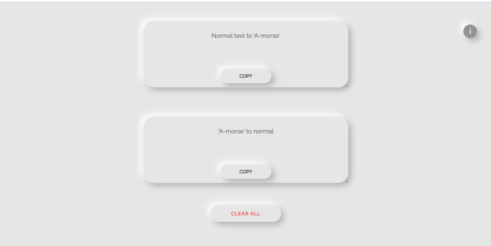

# AAA-translation

An app that translates a sentence into a string of upper and lower case 'A'. Upper case 'A' represents '-' and lower case 'a' represents '.'. Originally made this app for the subreddit r/AAAAAAAAAAAAAAAAA. I hope that great things will be accomplished with the aid of my application. (im joking, having a hard time coming up with an actual use-case). 

Tha app uses regex server-side to translate the input. I originally wanted to do the translation on the frontend for performance-reasons but realized that safari didnt have full support for regex so decided to translate server-side for compatibility. 

Live site: https://aaa-translator.herokuapp.com/

